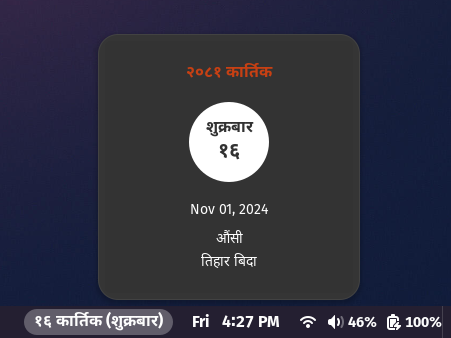

# Nepali Calendar Gnome Shell Extension
This is a gnome shell extension that shows Nepali calendar in the top bar of Gnome Shell. 


## Screenshots


## Installation

 [](https://extensions.gnome.org/extension/7490/nepali-calendar/)


## Manual Installation
1. Clone this repository.
   ```bash
    git clone git@github.com:PublisherName/nepali-calendar-gs-extension.git
    ```

2. Change directory to the cloned repository.
    ```bash
    cd nepali-calendar-gs-extension
    ```
3. Run the following command to install the extension.
    ```bash
    ./install.sh
    ```
4. Restart Gnome Shell.
    ```bash
    Alt + F2
    r
    ```
5. Enable the extension using Gnome Tweaks or Extensions application.

## Usage
The extension shows the current Nepali date in the top bar of Gnome Shell. Clicking on the date will show the Nepali date and event for the current day.

## License
This project is licensed under the GNU General Public License v3.0 - see the [LICENSE](LICENSE) file for details.
